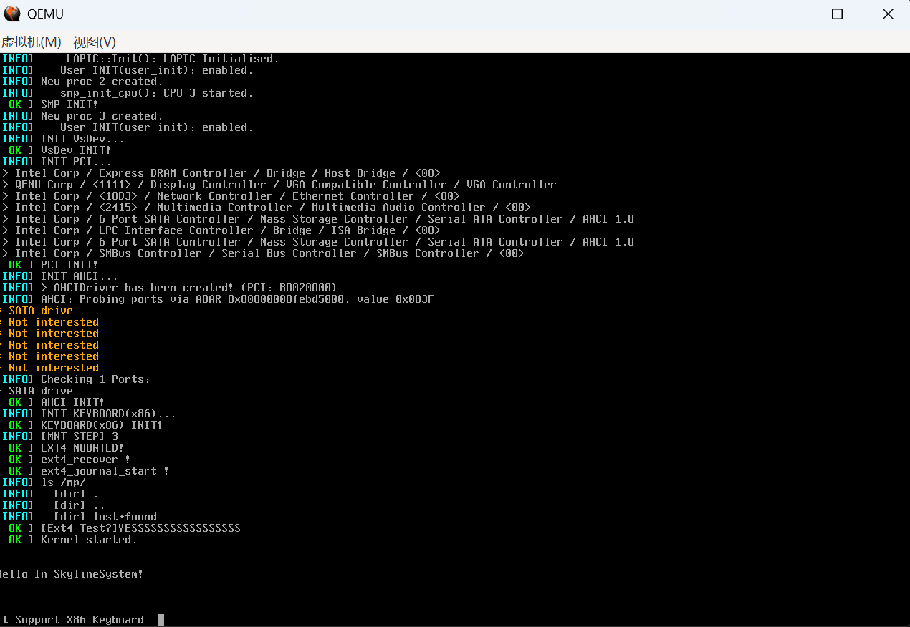

# SkylineSystem

> [!DANGER]
> Don't run it in real machine(because it's now in test)

## How to build

Make sure you have install these software linux

* gcc (VER > 10)
* binutil
* xorriso
* make
* e2cp

Run with this command in the project root dir

> [!WARNING]
> Be sure to modify the commands commented in build.sh!

```bash
make cm

# Next build test app and copy to img
# Be sure to modify the commands commented in build.sh!
./build.sh

```

> [!TIP]
> You can run qemu with these commands
```bash
# just run x86_64 qemu example command
qemu-system-x86_64 -machine q35 -cpu qemu64,+x2apic,+avx \
-cdrom SkylineSystem-x86_64.iso -m 2G -smp 4 \
-serial stdio -net nic -device AC97 \
-drive file=disk.img,if=none,id=sata1 \
-device ahci,id=ahci1 \
-device ide-hd,drive=sata1,bus=ahci1.0 \
-no-reboot --no-shutdown \
-gdb tcp::26000 -monitor telnet:127.0.0.1:4444,server,nowait
```

## Features(x86_64)



* Devices
  * AHCI
  * IDE
  * ACPI
  * IOAPIC
  * LAPIC
* Basics
  * Syscall
  * Scheduler
  * Output
  * SMP
  * Virtual Memory
* Disk Interfaces
  * Sata
  * Ram

* File Systems Support
  * Fat12
  * Fat16
  * Fat32
  * Exfat
  * ext2/3/4

* Dynamic File System Type Check(get_fs_type!)

Many more in future

## Thanks to

* [MaslOS](https://github.com/marceldobehere/MaslOS)
* [VisualOS](https://github.com/nothotscott/VisualOS)
* [MicroOS](https://github.com/Glowman554/MicroOS)
* [LanOS](https://github.com/asterd-og/LanOS/)
* [MaslOS-2](https://github.com/marceldobehere/MaslOS-2/)
* [HanOS](https://github.com/jjwang/HanOS/)

## Unfinished features

* PCI MSI/MSIX
* NVME
* VFS

## Contributors

* [Yo-yo-ooo](https://github.com/Yo-yo-ooo/)
* [marceldobehere](https://github.com/marceldobehere)

[//]: (https://github.com/asterd-og/)
