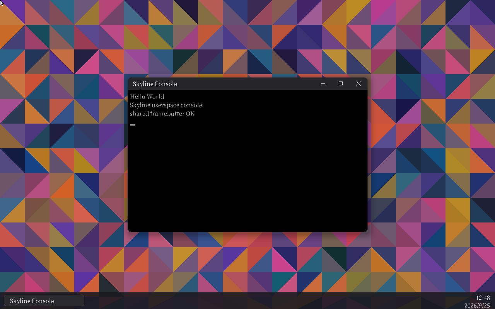

```text
  /$$$$$$  /$$                 /$$ /$$                      /$$$$$$                        /$$
 /$$__  $$| $$                | $$|__/                     /$$__  $$                      | $$
| $$  \__/| $$   /$$ /$$   /$$| $$ /$$ /$$$$$$$   /$$$$$$ | $$  \__/ /$$   /$$  /$$$$$$$ /$$$$$$    /$$$$$$  /$$$$$$/$$$$
|  $$$$$$ | $$  /$$/| $$  | $$| $$| $$| $$__  $$ /$$__  $$|  $$$$$$ | $$  | $$ /$$_____/|_  $$_/   /$$__  $$| $$_  $$_  $$
 \____  $$| $$$$$$/ | $$  | $$| $$| $$| $$  \ $$| $$$$$$$$ \____  $$| $$  | $$|  $$$$$$   | $$    | $$$$$$$$| $$ \ $$ \ $$
 /$$  \ $$| $$_  $$ | $$  | $$| $$| $$| $$  | $$| $$_____/ /$$  \ $$| $$  | $$ \____  $$  | $$ /$$| $$_____/| $$ | $$ | $$
|  $$$$$$/| $$ \  $$|  $$$$$$$| $$| $$| $$  | $$|  $$$$$$$|  $$$$$$/|  $$$$$$$ /$$$$$$$/  |  $$$$/|  $$$$$$$| $$ | $$ | $$
 \______/ |__/  \__/ \____  $$|__/|__/|__/  |__/ \_______/ \______/  \____  $$|_______/    \___/   \_______/|__/ |__/ |__/
                     /$$  | $$                                       /$$  | $$
                    |  $$$$$$/                                      |  $$$$$$/
                     \______/                                        \______/
```
<p align="center">
  
  <br><em>A from-scratch x86_64 SMP OS with a CPU-parallel software compositor —
  a rounded console over the wallpaper and an acrylic taskbar with app pill,
  battery and a live clock. Boots in 128 MB, scales across cores.</em>
</p>

## License
[](./LICENSES/GPL-2.0-only)
[](./LICENSES/MIT.txt)
[](https://www.gnu.org/licenses/gcc-exception-3.1.html)

* **`kernel/`**: GPL-2.0-only
* **`lib/` `programs/` `ablib/atomic/`**: MIT License
Kernel and userspace run in separate address spaces, communicate only via syscall, no GPL copyleft infection.
Full compliance with REUSE standard, see root LICENSES for full statement.
* **`/ablib/freestndchdrs/`**: This directory is licensed under the **GNU General Public License v3.0 (GPLv3)**, supplemented with the **GCC Runtime Library Exception 3.1**. 
    *   *What this means:* You may link this library into your proprietary/closed-source application without being required to release your own source code. 
    *   Please refer to `COPYING3.RUNTIME` within that folder for full details.

> [!CAUTION]
> Don't run it in real machine because it's now in test
> If Build Failed, please open an issue or contact me
> The General Build Faild reason is you don't have install the required dependencies <br>
> [OR] You are building for unsupported architecture <br>


---

## ✨ SkylineSystem at a Glance


> **A modern, from-scratch SMP operating system for x86_64 — scheduler, virtual
> memory, filesystems, drivers, a userspace libc, a CPU-parallel GUI compositor
> and a window manager, every layer original and all in this tree.**

SkylineSystem is **not** a Linux distribution and does **not** target the
POSIX/Linux ABI. Every syscall interface, allocator, scheduler and GUI protocol
is designed here on purpose. The project chases **depth on one architecture** —
a genuinely modern, desktop-class core — instead of a thin compatibility shell
over somebody else's design. It boots in **128 MB of RAM**, scales across cores,
and keeps the pointer and the screen fluid even while userspace spins inside
tight `for(;;)` loops.

### 🚀 Highlights

- **🧠 Self-designed 3EVDF scheduler** — a *Rate-aware EEVDF* that adds an
  instruction-pointer **RIP-progress-rate** term with dynamic fast/slow
  multipliers, so a CPU-bound busy-loop can no longer starve interactive work.
- **⚡ CPU-parallel software compositor** — one worker pinned per online CPU
  renders a horizontal screen strip; a barrier-separated double buffer removes
  tearing, and scene traversal is **O(window count)**.
- **🪟 A real window manager, not just a window** — SDF anti-aliased rounded
  corners and soft directional drop shadows, plus caption-bar **dragging**,
  **maximize**, **minimize** (restore from the taskbar pill) and
  **8-direction edge/corner resizing**; the close button really **terminates
  the client process** and reclaims its threads and pages through `sys_kill`.
- **📊 Acrylic taskbar with a live calendar** — a Win11/macOS-style translucent
  taskbar with an app pill, a battery indicator and a two-line clock showing
  **HH:MM over YYYY/M/D**, converted from the kernel's real UTC epoch time.
- **🖱️ A pointer that never stalls** — the cursor is its own layer written
  straight to the scanout in O(16²), fully decoupled from scene composition;
  moving the mouse never wakes the workers or recomposes the screen.
- **💾 A serious memory stack** — 5-level paging, 1 GB / 2 MB huge pages,
  copy-on-write with dynamic huge-page splitting, per-CPU physical caches, a
  SLUB kernel heap, VMA management and batched TLB flushes.
- **🔐 Hardening built in** — KASLR, SMAP, isolated user/kernel address spaces
  and refcounted shared-memory grants.
- **🧰 Real I/O & filesystems** — PS/2 keyboard/mouse, framebuffer,
  AHCI/ATA/ATAPI, NVMe and USB, plus FAT, ext4 (lwext4) and the SAF format.
- **🪶 Tiny and self-contained** — a single Limine image (BIOS + UEFI), a
  traditional Makefile build and freestanding `-Wall -Wextra -Werror`.

### 🧠 3EVDF — a Rate-aware EEVDF scheduler

Plain EEVDF schedules from virtual time and lag, but it cannot distinguish a
thread that is **making real progress** from one that is simply **burning the
CPU in a tight loop**. 3EVDF adds a **RIP-progress-rate** signal: the kernel
samples how fast a thread's instruction pointer advances, derives fast/slow
multipliers and feeds them back into EEVDF's parameters at runtime. Progressing
and I/O-bound threads are favoured, while pure busy-spinners are throttled —
with **no manual `yield()` required from the application**.

**Measured on this system:** with only **128 MB** of RAM, a single process that
launches **four `for(;;)` threads** still leaves mouse sampling and display
compositing perfectly smooth; on the earlier scheduler that same workload only
stayed responsive with an explicit `sys_yield()`.

### 🎞️ A parallel compositor and a modern GUI stack

The desktop is a data-parallel renderer with **zero per-pixel locking**:

- **N workers = online CPUs**, discovered at runtime through `sys_sysinfo`; the
  screen is divided into N equal horizontal strips on disjoint Y ranges.
- **Two barrier-separated phases per frame** — every worker first renders its
  strip into an invisible back buffer, and rows reach the scanout only after
  the whole frame is finished, so a preempted worker can never flash a black
  horizontal band (no tearing).
- **Two independent, dynamic linked lists** — layers, and windows inside each
  layer. Each window is visited once with an O(1) clip test and blitted a full
  scanline at a time; traversal is **O(window count)**, never a per-pixel
  top-most search.
- **Dirty-rectangle, compare-and-blit presentation** — a static scene performs
  zero scanout writes outside the cursor squares.
- **Per-pixel ARGB alpha** — rounded corners and shadows source-over blend over
  whatever is below, while runs of opaque pixels still use `memcpy`, so the
  visual effect costs almost nothing.
- **The WM owns the chrome, the app stays portable** — the desktop paints the
  entire window decoration; a console client is plain standard C
  (`printf` + `return 0`) with zero Skyline-specific boilerplate and builds
  unmodified on any hosted toolchain.
- **Full window lifecycle in userspace** — the WM handles caption drag,
  maximize, minimize and 8-way edge resize, and the close button drives
  `sys_kill` so the client process — every thread and its whole address space —
  is genuinely reclaimed, not just detached. A lightweight rectangle previews
  live during resize; the heavy rounded/shadowed chrome is rasterized once on
  release, keeping the pointer at full speed throughout.

Text comes from an in-tree TTF rasterizer: LRU + hash-table glyph caching, CJK
typography rules, true typographic line height and boundary-clipped alpha
blending onto the linear framebuffer.

### 🧭 Design philosophy

| Principle | What it means in SkylineSystem |
|---|---|
| **Built from zero** | No POSIX/Linux ABI and no ported userspace — every interface is an original design, so legacy never dictates the architecture. |
| **Depth over breadth** | One architecture (x86_64) done deeply instead of many done shallowly; aarch64 / RISC-V / LoongArch build templates are provided. |
| **Mechanism vs policy** | The window manager, shell and compositing policy live in userspace; the kernel exposes only minimal mechanisms (shared frames, threads, sysinfo). |
| **Clean by construction** | Freestanding C/C++, a traditional Makefile, `-Wall -Wextra -Werror`, and a split GPL kernel / MIT userspace license model. |
| **Solo-built, depth-first** | Primarily designed and implemented by one developer, and benchmarked against team projects on single-architecture kernel depth. |

### 🧩 Feature status

| Subsystem | Status | Notes |
|---|:---:|---|
| Boot — Limine (BIOS + UEFI) | ✅ | ISO / HDD images |
| SMP multicore | ✅ | Per-CPU structures, pinned workers |
| Scheduler — 3EVDF / Rate-aware EEVDF | ✅ | RIP-progress-rate, dynamic multipliers |
| Virtual memory | ✅ | 5-level paging, huge pages, CoW + split |
| Physical & kernel heap | ✅ | Per-CPU caches, SLUB, QSBR, lock-free bitmap |
| Security | ✅ | KASLR, SMAP, isolated address spaces |
| Device drivers | ✅ / 🚧 | PS/2, framebuffer, AHCI/ATA/ATAPI, NVMe, USB |
| Filesystems | ✅ | FAT, ext4 (lwext4), SAF packed format |
| GUI / window manager | ✅ | Parallel strips, rounded windows, drag/max/min/8-way resize, kill, TTF/CJK, SW cursor |
| Taskbar / clock | ✅ | Acrylic bar, app pill, battery icon, two-line HH:MM + YYYY/M/D |
| Userspace | ✅ | Own libc/`printf`, ELF loader, threads + TLS, shared memory |
| Networking | 🚧 | Early stack skeleton |
| Other architectures | 🚧 | aarch64 / RISC-V / LoongArch build templates |

### ⚙️ `SkylineSystem Low-Level Stack Implementations`

I have independently designed and implemented a comprehensive low-level stack from scratch:

<table>
  <tr>
    <td valign="top" width="50%">
      <h3 align="center">💾 Memory Management</h3>
      <ul>
        <li><b>VMM:</b> 5-level paging, 1GB/2MB huge pages, and copy-on-write with dynamic huge page splitting.</li>
        <li><b>PMM:</b> 3-level physical manager with lazy bitmap initialization and per-CPU caches to eliminate spinlock contention.</li>
      </ul>
    </td>
    <td valign="top" width="50%">
      <h3 align="center">⚡ Core & Concurrency</h3>
      <ul>
        <li><b>Allocator:</b> <code>malloc</code>/<code>free</code> engine with QSBR garbage collection, TLS batching, and lock-free bitmap CAS.</li>
        <li><b>VFS & FD:</b> Hashmap mount point resolution and bitmap-based file descriptor allocator with O(1) tail insertion.</li>
      </ul>
    </td>
  </tr>
  <tr>
    <td colspan="2" valign="top">
      <h3 align="center">🎨 Graphics & UI</h3>
      <ul>
        <li><b>Graphics:</b> TTF rasterization engine with LRU+hashtable glyph caching, CJK typography rules, and strict boundary-clipped alpha blending for the linear framebuffer.</li>
      </ul>
    </td>
  </tr>
</table>


## How to build

> [!IMPORTANT]
> Make sure you have install these software in linux
> * gcc (VER > 10)
> * clang (VER > 15)
> * binutil
> * xorriso
> * make
> * e2cp (ext2/3/4 tool)
> Run with this command in the project root dir

**You can build this project(x86_64 arch) with these commands:**
```bash
cd kernel && ./get-deps
cd .. && make limine-binary/limine
#If can't run get-deps script, you can run "chmod +x kernel/get-deps"
make cm
```
## Build Template(Not applicable to x86_64)
> [!CAUTION]
> You must edit the 'BUILD_ARCH' variable in 'gdef.mk' file 
> to set the architecture you want to build for.

For example if you want to build aarch64 OS,In gdef.mk you must change:
```patch
- # BUILD_ARCH = x86_64
+ BUILD_ARCH = aarch64
```
```bash
make cm KCC=(XXX arch)-linux-gnu-gcc KCXX=(XXX arch)-linux-gnu-g++ KLD=(XXX arch)-linux-gnu-ld
```
For example, to build aarch64 arch, run:
```bash
make cm KCC=aarch64-linux-gnu-gcc KCXX=aarch64-linux-gnu-g++ KLD=aarch64-linux-gnu-ld BUILD_ARCH=aarch64
```

> [!IMPORTANT]
> You must run 'cd kernel && make kaslr-check' first
> This Command can check SkylineSystem kernel IS/NOT SUPPORT KASLR Feature

## Run
### In Linux:
```bash
# just run x86_64 qemu example command
qemu-system-x86_64 -machine q35 -cpu max \
-cdrom ./SkylineSystem-x86_64.iso -m 2G -smp 4 \
-serial stdio -net nic -device AC97 \
-drive file=disk.img,if=none,id=drive0 \
-device ide-hd,drive=drive0,bus=ide.0 \
-no-reboot --no-shutdown \
-gdb tcp::26000 -monitor telnet:127.0.0.1:4444,server,nowait 
```
### In WSL(Windows Subsystem for Linux):
see ./res/scripts/ folder run the arch you need to run
## Debug
```bash
#first run qemu
# just run x86_64 qemu example command
qemu-system-x86_64 -machine q35 -cpu max \
-cdrom ./SkylineSystem-x86_64.iso -m 2G -smp 4 \
-serial stdio -net nic -device AC97 \
-drive file=disk.img,if=none,id=drive0 \
-device ide-hd,drive=drive0,bus=ide.0 \
-no-reboot --no-shutdown \
-gdb tcp::26000 -monitor telnet:127.0.0.1:4444,server,nowait -S
#run gdb on kernel folder
cd kernel && gdb
```
In GDB:
```bash
#and enter these command in gdb
target remote :26000
file kernel
#do like you what you want to do than
```


## Thanks to

* [MaslOS](https://github.com/marceldobehere/MaslOS)
* [VisualOS](https://github.com/nothotscott/VisualOS)
* [MicroOS](https://github.com/Glowman554/MicroOS)
* [MaslOS-2](https://github.com/marceldobehere/MaslOS-2/)
* [HanOS](https://github.com/jjwang/HanOS/)
* [SAF](https://github.com/chocabloc/saf)


## Main Contributors

* [Yo-yo-ooo](https://github.com/Yo-yo-ooo/)
* [marceldobehere](https://github.com/marceldobehere)
* [Arty3](https://github.com/Arty3)
* 人造人(In QQ)


## Connect

**You can connect with e-mail <1218849168@qq.com>** 
