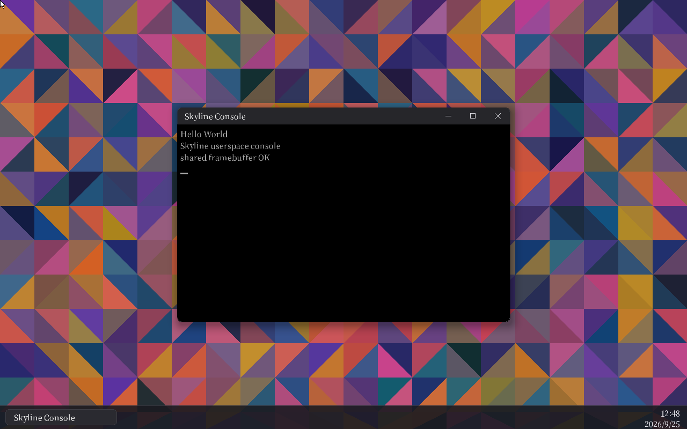

```text
  /$$$$$$  /$$                 /$$ /$$                      /$$$$$$                        /$$
 /$$__  $$| $$                | $$|__/                     /$$__  $$                      | $$
| $$  \__/| $$   /$$ /$$   /$$| $$ /$$ /$$$$$$$   /$$$$$$ | $$  \__/ /$$   /$$  /$$$$$$$ /$$$$$$    /$$$$$$  /$$$$$$/$$$$
|  $$$$$$ | $$  /$$/| $$  | $$| $$| $$| $$__  $$ /$$__  $$|  $$$$$$ | $$  | $$ /$$_____/|_  $$_/   /$$__  $$| $$_  $$_  $$
 \____  $$| $$$$$$/ | $$  | $$| $$| $$| $$  \ $$| $$$$$$$$ \____  $$| $$  | $$|  $$$$$$   | $$    | $$$$$$$$| $$ \ $$ \ $$
 /$$  \ $$| $$_  $$ | $$  | $$| $$| $$| $$  | $$| $$_____/ /$$  \ $$| $$  | $$ \____  $$  | $$ /$$| $$_____/| $$ | $$ | $$
|  $$$$$$/| $$ \  $$|  $$$$$$$| $$| $$| $$  | $$|  $$$$$$$|  $$$$$$/|  $$$$$$$ /$$$$$$$/  |  $$$$/|  $$$$$$$| $$ | $$ | $$
 \______/ |__/  \__/ \____  $$|__/|__/|__/  |__/ \_______/ \______/  \____  $$|_______/    \___/   \_______/|__/ |__/ |__/
                     /$$  | $$                                       /$$  | $$
                    |  $$$$$$/                                      |  $$$$$$/
                     \______/                                        \______/
```
<p align="center">
  
  <br><em>An x86_64 SMP hobby OS with a CPU-parallel software compositor —
  a rounded console over the wallpaper and an acrylic taskbar with app pill,
  battery and a live clock. Runs in QEMU (tested with 512 MB – 2 GB RAM).</em>
</p>

## License
[](./LICENSES/GPL-2.0-only)
[](./LICENSES/MIT)
[](https://www.gnu.org/licenses/gcc-exception-3.1.html)

* **`kernel/`**: GPL-2.0-only
* **`lib/` `programs/` `ablib/atomic/`**: MIT License
Kernel and userspace run in separate address spaces, communicate only via syscall, no GPL copyleft infection.
SPDX headers are being adopted progressively (work in progress — not yet full
REUSE compliance); see LICENSES/ and the per-file SPDX tags.

> [!NOTE]
> The kernel vendors third-party code (lwIP, FatFs, lwext4, flanterm, SAF,
> adapted libart / tidwall hashmap, **mpaland/printf** and the **x86mem**
> memops). Their licenses are BSD-3 / BSD-2 / FatFs-license / MIT / MIT /
> MIT respectively and are preserved in the source files.

* **`/ablib/freestndchdrs/`**: This directory is licensed under the **GNU General Public License v3.0 (GPLv3)**, supplemented with the **GCC Runtime Library Exception 3.1**. 
    *   *What this means:* You may link this library into your proprietary/closed-source application without being required to release your own source code. 
    *   Please refer to `COPYING3.RUNTIME` within that folder for full details.

> [!CAUTION]
> Don't run it on a real machine — it is still in test.
> If the build fails, please open an issue or contact me.
> The most common reasons are missing dependencies or an unsupported architecture.

---

## ✨ SkylineSystem at a Glance


> **A hobby x86_64 SMP operating system — scheduler, virtual memory,
> filesystems, drivers, a userspace libc, a CPU-parallel GUI compositor and
> a window manager, all in this tree. Many layers are original; some data
> structures and filesystems are adapted or vendored (see License above).**

SkylineSystem is **not** a Linux distribution and does **not** target the
POSIX/Linux ABI. It chases **depth on one architecture** (x86_64). It has
been tested in QEMU only, with 512 MB – 2 GB of guest RAM; the earlier
"128 MB" claim was never verified and has been removed.

### 🚀 Highlights

- **🧠 EEVDF scheduler** ("3EVDF" 为早期曾用名, 见 `docs/scheduler.md`) —
  a deadline-based scheduler with a **RIP-progress-rate** feedback term
  (Q10 fixed point, dual-channel EWMA). The feedback modulates each thread's
  **time-slice length** (the LAPIC oneshot quantum); it does **not** change
  CPU share — see the honest description in `docs/scheduler.md`.
- **⚡ CPU-parallel software compositor** — the main thread renders strip 0
  and **N−1 workers** render the remaining horizontal strips into an
  off-screen back buffer; the main thread alone commits the frame to the
  scanout. Per-frame cost is O(strips × windows).
- **🪟 A working window manager** — SDF anti-aliased rounded corners and soft
  directional drop shadows, plus caption-bar **dragging**, **maximize**,
  **minimize** (restore from the taskbar pill) and **8-direction
  edge/corner resizing** for the console window; the close button really
  **terminates the client process** through `sys_kill`. (Notepad is
  registered but not yet managed by the WM — see `docs/gui.md`.)
- **📊 Acrylic taskbar with a two-line date/time clock** — a Win11/macOS-style
  translucent taskbar with an app pill and a two-line
  clock showing **HH:MM over YYYY/M/D**.
- **🖱️ A decoupled cursor layer** — the cursor is its own layer written
  straight to the scanout in O(16²), independent of scene composition;
  moving the mouse does not trigger a full recompose.
- **💾 A real memory stack** — **4-level paging** (5-level code paths exist
  but are compiled out), 1 GB / 2 MB huge pages, copy-on-write (2 MB CoW
  copies the whole 2 MB; only 1 GB pages split, down to 2 MB), per-CPU
  physical-page caches, a SLUB kernel heap, VMA management and batched TLB
  shootdowns.
- **🔐 Hardening** — bootloader-provided KASLR slide, SMEP, SMAP,
  isolated user/kernel address spaces, refcounted shared-memory grants, and
  **W^X in userspace**: EFER.NXE is enabled and ELF segments are tightened
  to their `p_flags` (no-exec + no-write where declared).
- **🧰 Real I/O & filesystems** — PS/2 keyboard/mouse, framebuffer, AHCI,
  NVMe and USB (xHCI + MSC/HID); ext4 via lwext4 and the SAF archive format.
  **FAT glue is currently stubbed** and ATA/ATAPI are unregistered dead code.
- **🪶 Small and self-contained** — a single Limine image (BIOS + UEFI), a
  traditional Makefile build, and a **zero-warning kernel build**
  (`-Wall -Wextra`, 0 warnings as of this revision) with
  `-Wall -Wextra -Werror` for the userspace lib.

### 🧠 EEVDF scheduler — an honest description

The scheduler keeps a per-CPU red-black tree keyed by the **virtual
deadline**, augmented with `min_vruntime_subtree` and prefetch hints, plus
weighted time-slices, dynamic base-quantum adjustment and SMP push/steal
load balancing.

On top of that, the **RIP feedback** samples each thread's RIP progress
between timer ticks, derives fast/slow multipliers (Q10 fixed point,
dual-channel EWMA with dead-zone and hysteresis) and uses them to lengthen
or shorten the thread's **preemption quantum** — busy-spinners are
interrupted more often and progressing threads get longer uninterrupted
runs.

**What it is not:** the feedback does not enter `Pick()` — selection is
deadline-based, vruntime is charged from real elapsed time, and the virtual
deadline is `vruntime + const` (not weight-scaled). So the feedback shapes
**interrupt latency**, not CPU share. There is **no quantitative benchmark**
yet: `sched_bench.cpp` only validates that the EWMA values converge.
Details: `docs/scheduler.md`.

### 🎞️ A parallel compositor and a modern GUI stack

The desktop is a data-parallel renderer with **zero per-pixel locking**:

- **N strips, N−1 worker threads** — the online CPU count comes from
  `sys_sysinfo`; the main thread renders strip 0 itself and one worker is
  launched per remaining CPU, pinned by the kernel.
- **Double-buffered, single commit point** — every worker renders its strip
  into an invisible back buffer; only the main thread blits the finished
  frame to the scanout. The completion barrier is a simple counter (not a
  generation-checked barrier): the current protocol makes the race window
  **unreachable, but the structure is fragile** — see `docs/gui.md`.
- **Layer + window linked lists** — each window gets one clip test per
  strip and is blitted a scanline at a time; no per-pixel top-most search.
  Per-frame traversal is O(strips × windows).
- **Dirty-rectangle, compare-and-blit presentation** — a static scene
  performs zero scanout writes outside the cursor squares.
- **Per-pixel ARGB alpha** — rounded corners and shadows source-over blend,
  while runs of opaque pixels use `memcpy`.
- **The WM owns the chrome** — the desktop paints the entire window
  decoration; a console client is plain C (`printf` + `return 0`) linked
  against the in-tree libc. Note: it builds against this libc, **not**
  "unmodified on any hosted toolchain".
- **Full console-window lifecycle in userspace** — caption drag, maximize,
  minimize and 8-way resize, and the close button drives `sys_kill` so the
  client process — every thread and its address space — is reclaimed. A
  lightweight rectangle previews during resize; the heavy rounded/shadowed
  chrome is rasterized once on release.
- **Known gaps** — child-exit notification works via periodic liveness
  polling (`sys_kill(pid, 0)` probe + window removal); no z-order raise /
  focus, and minimize currently loses the maximized state.

Text is drawn by an in-tree TTF rasterizer (based on **stb_truetype**, with
LRU + hash-table glyph caching and CJK typography) and the **flanterm**
console renderer — both third-party components.

### 🧭 Design philosophy

| Principle | What it means in SkylineSystem |
|---|---|
| **Original where it counts** | No POSIX/Linux ABI; the syscalls, scheduler, compositor and WM are original. Core data structures (ART, hashmap, RB tree) and filesystems are adapted or vendored — attribution kept in-source. |
| **Depth over breadth** | One architecture (x86_64) done deeply; other-architecture ports are not implemented (Makefile flags exist only). |
| **Mechanism vs policy** | The window manager, shell and compositing policy live in userspace; the kernel exposes only minimal mechanisms (shared frames, threads, sysinfo). |
| **Clean by construction** | Freestanding C/C++, a traditional Makefile, zero-warning kernel build (`-Wall -Wextra`), `-Wall -Wextra -Werror` for lib, and a split GPL kernel / MIT userspace license model. |
| **Solo-built, depth-first** | Designed and implemented primarily by one developer. |

### 🧩 Feature status

| Subsystem | Status | Notes |
|---|:---:|---|
| Boot — Limine (BIOS + UEFI) | ✅ | ISO / HDD images |
| SMP multicore | ✅ | Per-CPU structures, AP bring-up |
| Scheduler — EEVDF + RIP feedback | ✅ / 🚧 | RIP feedback modulates time-slice length, not CPU share; no benchmark |
| Virtual memory | ✅ | 4-level paging, huge pages, CoW (2 MB granular), W^X |
| Physical & kernel heap | ✅ | Single global PMM lock + per-CPU page cache; SLUB/SLAB; userspace allocator uses epoch QSBR deferred reclamation |
| Security | ✅ / 🚧 | KASLR (bootloader slide), SMEP, SMAP, NX/W^X, isolated address spaces |
| Device drivers | ✅ / 🚧 | PS/2, framebuffer, AHCI, NVMe, USB (xHCI); ATA/ATAPI unregistered |
| Filesystems | ✅ / 🚧 | ext4 (lwext4) + SAF working; FAT glue stubbed |
| GUI / window manager | ✅ / 🚧 | Parallel strips, rounded windows, drag/max/min/8-way resize, kill, TTF/CJK, SW cursor; WM manages the console window only |
| Taskbar / clock | ✅ | Acrylic bar, app pill, two-line HH:MM + YYYY/M/D |
| Userspace | ✅ | Own libc/`printf`, ELF loader, threads + TLS, shared memory |
| Networking | ✅ / 🚧 | e1000 (82574L) driver + lwIP wired: DHCP, ICMP ping, UDP/TCP TX+RX in QEMU slirp; see `docs/network.md` |
| Other architectures | ❌ | Not implemented (Makefile flags exist, ports pending) |

### ⚙️ `SkylineSystem Low-Level Stack Implementations`

<table>
  <tr>
    <td valign="top" width="50%">
      <h3 align="center">💾 Memory Management</h3>
      <ul>
        <li><b>VMM:</b> 4-level paging (5-level stubbed), 1GB/2MB huge pages, copy-on-write, W^X via p_flags.</li>
        <li><b>PMM:</b> bitmap frame allocator guarded by one global lock, plus a per-CPU cache for single-page requests.</li>
      </ul>
    </td>
    <td valign="top" width="50%">
      <h3 align="center">⚡ Core & Concurrency</h3>
      <ul>
        <li><b>Allocator:</b> userspace <code>malloc</code>/<code>free</code> with epoch-QSBR deferred reclamation; kernel SLUB/SLAB with per-CPU magazines and a double-free guard.</li>
        <li><b>VFS & FD:</b> hashmap mount-point resolution and a sharded red-black-tree fd allocator.</li>
      </ul>
    </td>
  </tr>
  <tr>
    <td colspan="2" valign="top">
      <h3 align="center">🎨 Graphics & UI</h3>
      <ul>
        <li><b>Graphics:</b> TTF rasterization (stb_truetype-based) with LRU+hashtable glyph caching, CJK typography, boundary-clipped alpha blending onto the linear framebuffer.</li>
      </ul>
    </td>
  </tr>
</table>


## How to build

> [!IMPORTANT]
> Make sure you have installed these tools on Linux:
> * gcc (VER > 10)
> * clang (VER > 15)
> * binutils
> * xorriso
> * make
> * e2cp (ext2/3/4 tool)
> Run the commands below in the project root directory.

**Build (x86_64):**
```bash
cd kernel && ./get-deps
cd .. && make limine-binary/limine
# if get-deps cannot run, try "chmod +x kernel/get-deps"
make cm
```

> [!NOTE]
> Since this revision, `make cm` no longer reformats an existing `disk.img`
> (it is only created when absent). Wipe it manually if you really want a
> fresh filesystem.

## Build Template (not applicable to x86_64)
> [!CAUTION]
> You must edit the 'BUILD_ARCH' variable in 'gdef.mk'
> to set the architecture you want to build for.

For example, to try aarch64, in gdef.mk change:
```patch
- # BUILD_ARCH = x86_64
+ BUILD_ARCH = aarch64
```
```bash
make cm KCC=(XXX arch)-linux-gnu-gcc KCXX=(XXX arch)-linux-gnu-g++ KLD=(XXX arch)-linux-gnu-ld
```
For example, to build aarch64:
```bash
make cm KCC=aarch64-linux-gnu-gcc KCXX=aarch64-linux-gnu-g++ KLD=aarch64-linux-gnu-ld BUILD_ARCH=aarch64
```

> [!IMPORTANT]
> Run 'cd kernel && make kaslr-check' first.
> This command checks whether the kernel image supports the KASLR feature.

> [!NOTE]
> Non-x86_64 ports are **not implemented** — only configuration flags
> exist. Expect build failures outside x86_64.

## Run
### In Linux:
```bash
# x86_64 QEMU example (网络验证需要 -net nic -net user = slirp DHCP)
qemu-system-x86_64 -machine q35 -cpu max \
-cdrom ./SkylineSystem-x86_64.iso -m 2G -smp 4 \
-serial stdio -net nic -net user -device AC97 \
-drive file=disk.img,if=none,id=drive0 \
-device ide-hd,drive=drive0,bus=ide.0 \
-no-reboot --no-shutdown \
-gdb tcp::26000 -monitor telnet:127.0.0.1:4444,server,nowait 
```
### In WSL (Windows Subsystem for Linux):
see the ./res/scripts/ folder for the architecture you need to run.

### Windows → WSL 构建指引 (D4, round 11):

1. 安装 WSL Ubuntu-24.04: PowerShell 管理员运行
   `wsl --install -d Ubuntu-24.04`, 重启后进入 Ubuntu 完成初始化。
2. 仓库放到 WSL 可访问路径 (推荐 `/mnt/c/...`, 或 WSL 家目录):
   ```bash
   cd /mnt/c/ && git clone <repo-url> SkylineSystem
   cd SkylineSystem
   ```
3. 安装工具链 (Ubuntu 内):
   ```bash
   sudo apt-get update && sudo apt-get install -y g++ gcc make clang xorriso
   ```
4. 构建 (与 Linux 相同):
   ```bash
   cd kernel && ./get-deps && cd ..
   make limine-binary/limine && make cm
   ```
5. 运行: 用 Windows 侧 QEMU (`qemu-system-x86_64.exe`) 直接加载
   `SkylineSystem-x86_64.iso`; 或 WSL 内装 `qemu-system-x86`。
6. 宿主测试门禁 (可选):
   ```bash
   cd tests && bash ../res/scripts/test/golden.sh
   ```

## Debug
```bash
# first run qemu (as above), then in another terminal:
cd kernel && gdb
```
In GDB:
```bash
target remote :26000
file kernel
```

## Thanks to

* [MaslOS](https://github.com/marceldobehere/MaslOS)
* [VisualOS](https://github.com/nothotscott/VisualOS)
* [MicroOS](https://github.com/Glowman554/MicroOS)
* [MaslOS-2](https://github.com/marceldobehere/MaslOS-2/)
* [HanOS](https://github.com/jjwang/HanOS/)
* [SAF](https://github.com/chocabloc/saf)

## Main Contributors

* [Yo-yo-ooo](https://github.com/Yo-yo-ooo/)
* [marceldobehere](https://github.com/marceldobehere)
* [Arty3](https://github.com/Arty3)
* 人造人(In QQ)

## Connect

**You can connect with e-mail <1218849168@qq.com>** 
